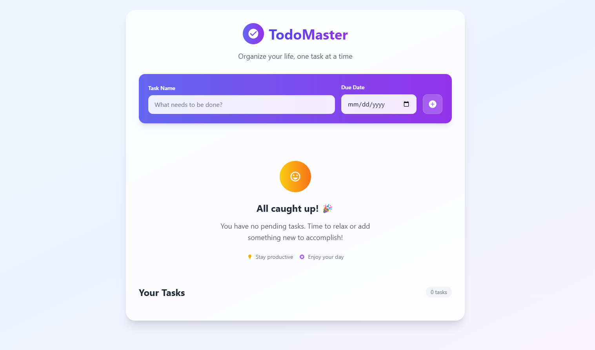
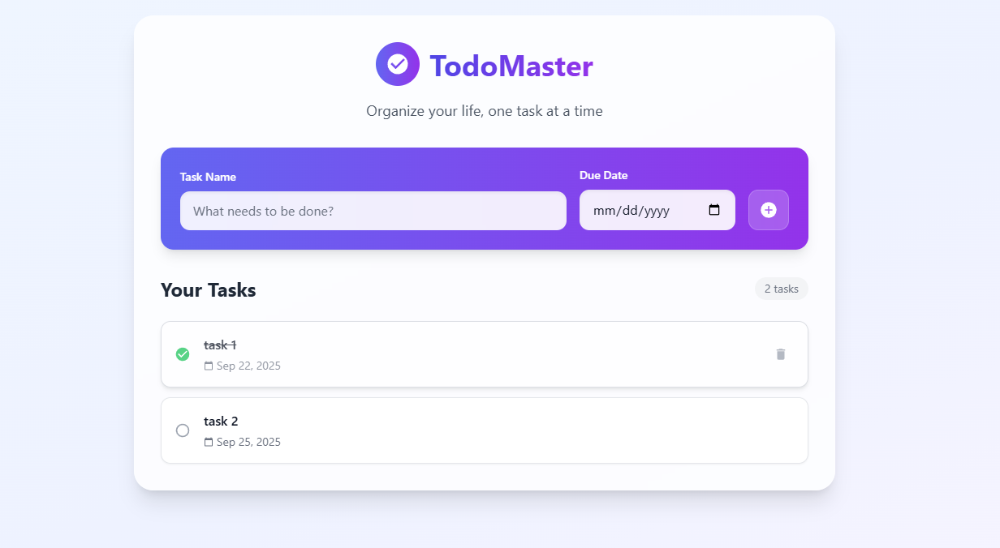

# ✅ Todo Application

<div align="center">
  
  
  
  
  
  


</div>

## 📝 **About**

A clean and intuitive todo application built with React. Features include task management, MongoDB storage, and a beautiful user interface with smooth animations.

---

## ✨ **Features**

### **Task Management**
<div align="center">
  
</div>

- ➕ Add new tasks
- ✅ Mark tasks as complete
- 🗑️ Delete unwanted tasks
- 📅 Date-wise organization
- 🔢 Task counter

---

## 🚀 **Quick Start**

```bash
# Clone the repository
git clone https://github.com/Hetav2211/Todo-App.git

# Navigate to directory
cd Todo-App

# Install dependencies
npm install

# Start development server
npm start
